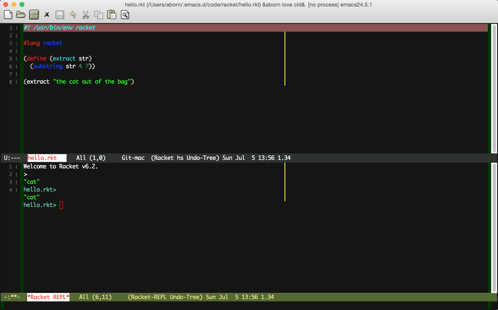

# emacs 搭建racket开发环境
emacs下搭建开发racket的环境，笔者之前用过以下两种模式：[geiser](http://www.nongnu.org/geiser/)和[racket-mode](https://github.com/greghendershott/racket-mode)。相对而言，后一种方式要显得简单，本文主要介绍后一种方式环境的搭建(注：笔者是mac系统，其他系统类似)：

## 下载和安装racket
首先得下载racket的编译和运行环境，下载地址为http://download.racket-lang.org/。笔者是mac系统，下载好.dmg文件后直接安装就好，非常方便。

## 执行路径
安装好后，先确保racket的可执行文件在你的$PATH里(window下叫环境变量)，在terminal下，运行如下命令，如果出现如下结果表示安装racket成功。
```
 ~  racket --version
 Welcome to Racket v6.2.
```
在mac里racket的可执行文件在这个路径下：
```
/Applications/Racket\ v6.2/bin
```
为了方便，我自己做了一个软链接到/usr/local/bin下
```
ln -s /Applications/Racket\ v6.2/bin/racket /usr/local/bin/racket
ln -s /Applications/Racket\ v6.2/bin/raco /usr/local/bin/raco
```

## emacs安装racket-mode
通过[MELPA](http://melpa.org/)进行安装，先设置安装源：
```
(require 'package)
(add-to-list 'package-archives
             '("melpa" . "http://melpa.org/packages/")
             t)
(package-initialize)
```
再通过以下emacs命令安装
```
M-x package-install <ret> racket-mode
```

## emacs配置
Emacs配置如下：
```elisp
(require 'racket-mode)
(setq racket-racket-program "racket")
(setq racket-raco-program "raco")
(add-hook 'racket-mode-hook
          (lambda ()
            (define-key racket-mode-map (kbd "C-x C-j") 'racket-run)))
```
注意：最后一行是绑定执行快捷键。

## 执行
下面是一个简单的racket程序，把它保存成hello.rkt文件

```elisp
#! /usr/bin/env racket

#lang racket

(define (extract str)
  (substring str 4 7))

(extract "the cat out of the bag")

```

执行这个程序，采用 M-x racket-run命令
如下图：

